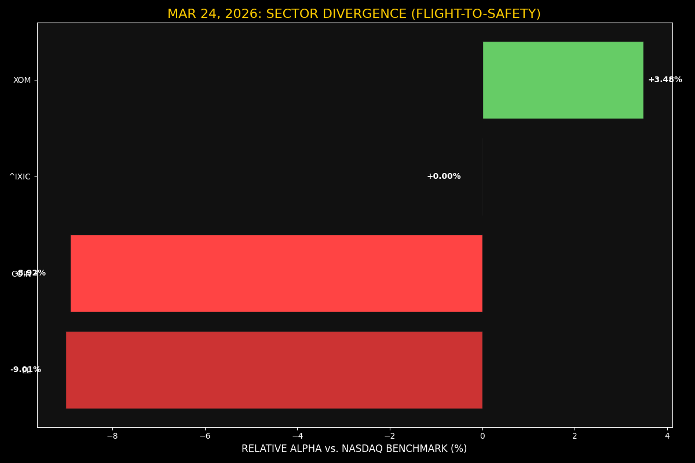
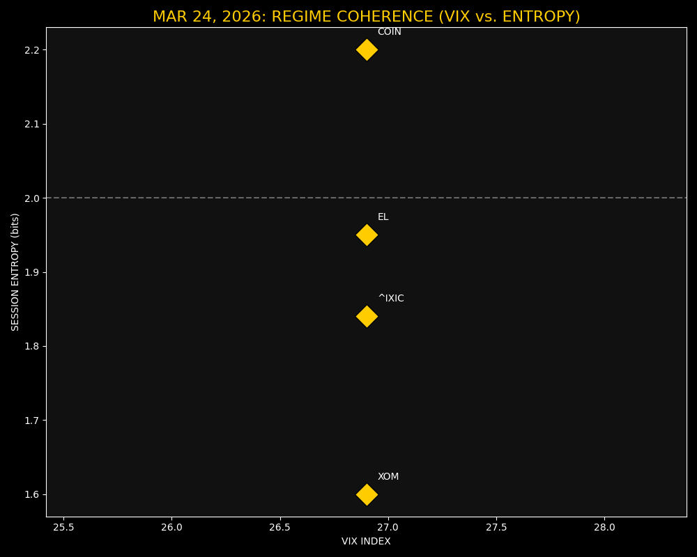

# IBM-Market-Intelligence-V1

## Sovereign High-Performance Market Intelligence Node

### EOD Market Audit (March 24, 2026)

### Technical Architecture
* **Language:** C++17 / Python 3.13
* **Memory Management:** Thread-local `MemoryStruct` allocation for safe `libcurl` callbacks.
* **Technical Engine:** Integrated with TA-Lib (0.4.0) for vectorized technical calculations.
* **Audit Trail:** Automatic CSV/JSON logging for historical entropy and rotation analysis.

---

### Advanced Diagnostic Visuals

#### 1. Sector Divergence Alpha
Visualizes the relative performance vs. the NASDAQ benchmark, highlighting the **+3.48% Divergence Alpha** in ExxonMobil (XOM).

#### 2. Regime Coherence Monitor
Maps the interaction between the **VIX Index (26.90)** and **Session Entropy (1.84 bits)** to identify coherent trend regimes.

---

### Key Technical Indicators (Mar 24, 2026)
* **NASDAQ 100 (^IXIC):** 21761.89 (-0.84%)
* **VIX Index:** 26.90 (Elevated Coherence)
* **Energy Alpha:** XOM +2.64% ($165.38)
* **Beta Flush:** COIN -9.76% ($181.04) | EL -9.85% ($71.48)

*Status: Node Operational | Location: Rio de Janeiro | Target: EmploymentMission2026*
