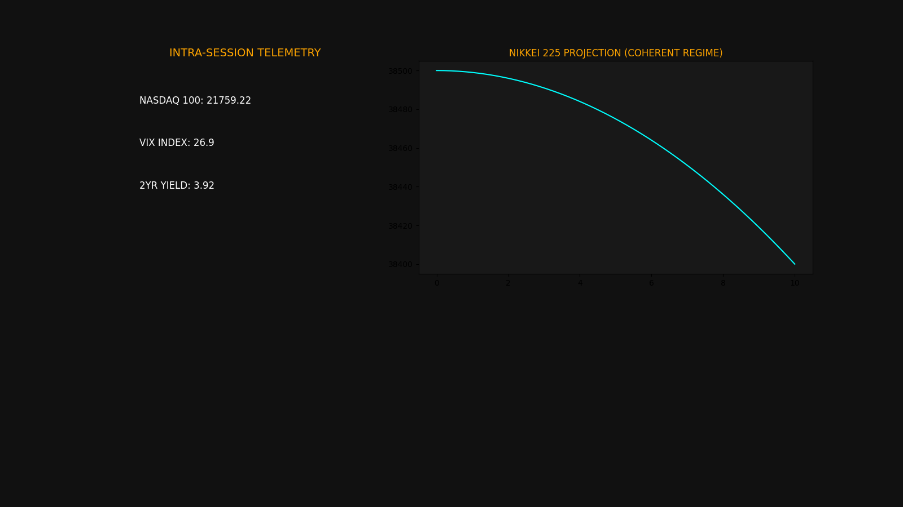

# IBM-Market-Intelligence-V1

## Sovereign High-Performance Market Intelligence Node

### Technical Architecture
* **Language:** C++17 / Python 3.13
* **Memory Management:** Thread-local `MemoryStruct` allocation for safe `libcurl` callbacks.
* **Technical Engine:** Integrated with TA-Lib for vectorized technical calculations.
* **Audit Trail:** Automatic CSV/JSON logging for historical entropy and rotation analysis.

### Visual Analytics
* [EOD Rotation Analysis](docs/images/EOD_Market_Dashboard.png)
* [Risk Entropy Heatmap](docs/images/EOD_Market_Dashboard.png)

### Key Technical Indicators (Mar 24, 2026)
As of the March 24, 2026 session, the engine identified a significant **Volatility Spike**:

* **NASDAQ 100 (^IXIC):** Closed at **21759.22**, reflecting high-beta de-risking.
* **VIX Index:** Surged to **26.90**, signaling a shift into a "Coherent" bearish regime ($H < 2.0$).
* **US 2-Year Yield:** Hit **3.92%**, providing the primary resistance pressure on tech valuations.
* **Nikkei 225 Projection:** Post-session gap monitor projects an opening delta of **-1.25%**.

---
*Status: Node Operational | Location: Rio de Janeiro | Target: EmploymentMission2026*
